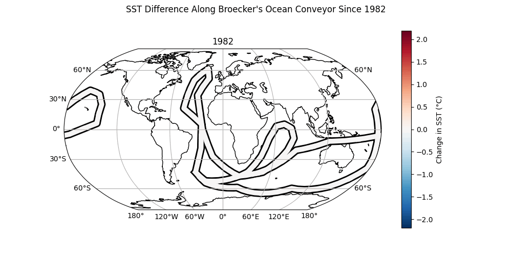

# Conveyor Analysis



Change in SST along Broecker's conveyor-belt path.

Path data is taken from R package `ocedata`. I generated a csv file from the data with the following
R code.

```R
> # install.packages('ocedata')
> data(conveyor, package="ocedata")
> write.csv(conveyor, './data/conveyor.csv')
```

The path is shown below:


The script to generate the above figure is `./src/conveyor_plot.py`.

## SST data

Satellite Sea Surface data is accessed via [Simons CMAP](https://simonscmap.com/), using `pycmap`.
The specific data set is the GHRSST Level 4 AVHRR_OI Global Blended Sea Surface Temperature Analysis
(GDS version 2) from NCEI. The details for this dataset are available
[here](https://simonscmap.com/catalog/datasets/Near_Real_Time_SST_AVHRR_OI). For each point along
the path above, I computed an annual time-series of SST - taking the mean from each year in the
available data.

Each point in the path forms a segment. The segments are constructed by computing the mid-point of
the line between from the previous point to the current point, and the mid-point of the line from
the current point to the next point. The segment is then formed by joining the previous midpoint to
the current point, and then to the next midpoint. The segments are then coloured by the current
point's SST value.

## Animation

The animation is generated from the frames by:

```sh
$ convert -delay 30 -loop 0 'figs/sst_frames/*' figs/conveyor_sst.gif
```

## Install

Instructions below are for linux.

Clone the repository. The below command places the repo in a directory `~/projects/ocean_conveyor`

```sh
$ git clone https://github.com/jtsiddons/conveyor_sst ~/projects/ocean_conveyor
```

Start a python virtual environment and activate it and install dependencies.

```sh
$ cd ~/projects/ocean_conveyor
$ python -m venv .
$ source ./bin/activate
$ pip install -r requirements.txt
```

You will also need to get an API key from [Simons CMAP](https://simonscmap.com/apikeymanagement).
You may need to create an account. Save the key as `data/api_key.csv`.
